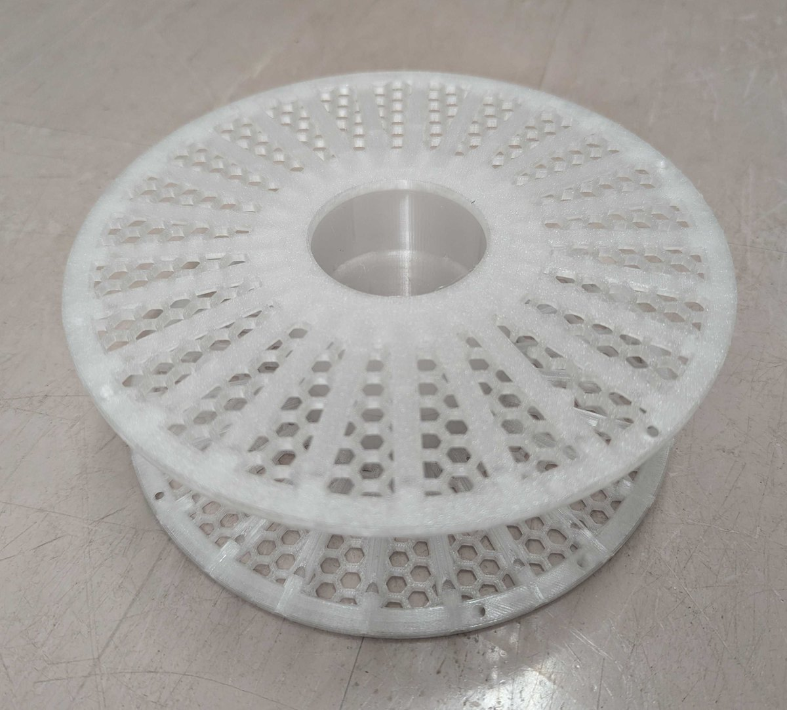
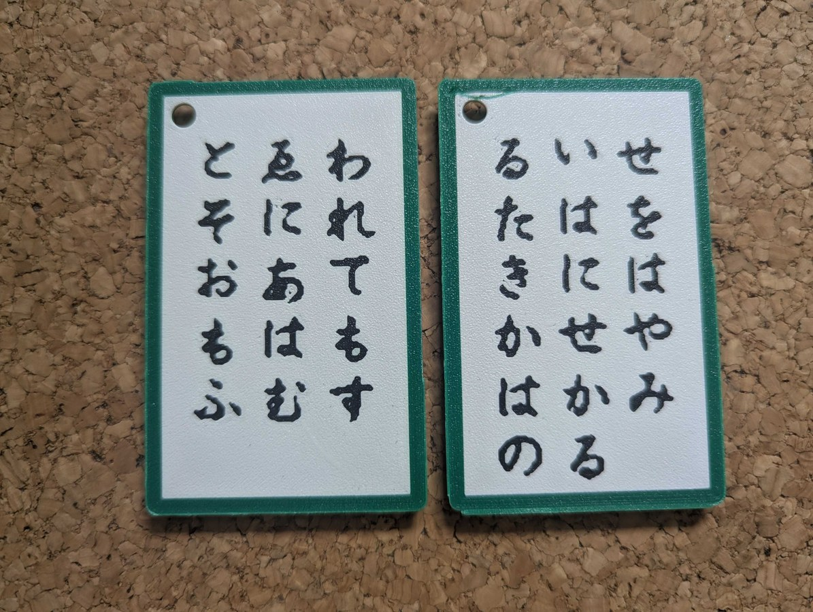
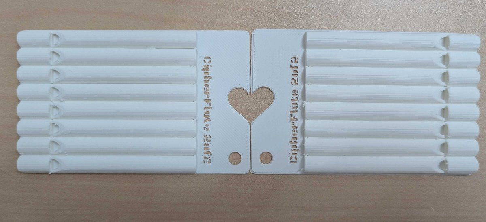
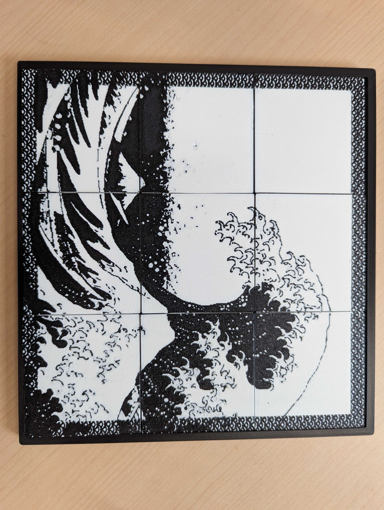
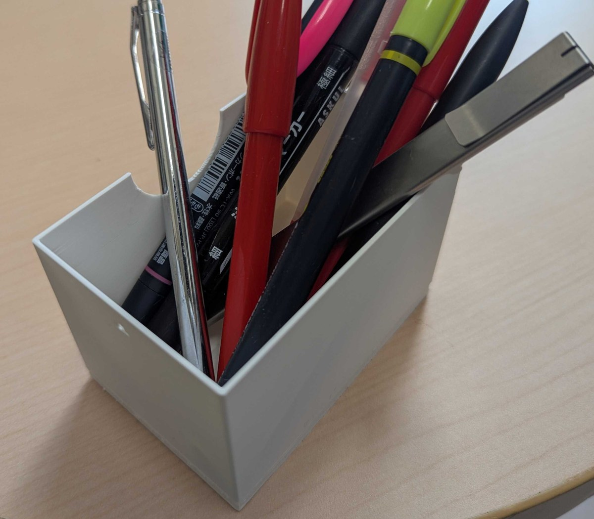
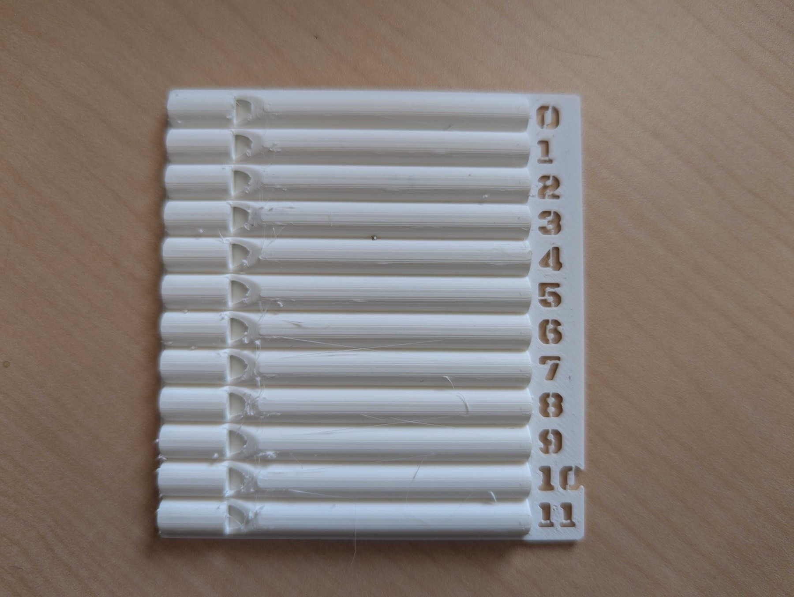

# CipherFlute

**3Dプリントした笛の音の高さに秘密を書き込み、吹いて読み出す。**

笛は電源も電子部品も持たない。家庭用の3Dプリンタで作れて、日用品の内部空洞として
存在できる。読み出しに特別な装置は要らない。

このリポジトリは、CipherFluteプロジェクトの成果物である。
開発は別のリポジトリで行っており、ここへはスクリプトで切り出している。

| | | |
|---|---|---|
|  |  |  |
|  |  |  |

写真の作例はどれも実機で復号まで通っている。詳しくは [`gallery/`](gallery/) を見ること。

## 5分で試す

1. `flutes/uniform/` の笛を何本か印刷する（0.20mm・サポートなし・ブリム8mm前後）
2. `decoder/index.html` をブラウザで開く
3. 「開始」を押して、印刷した笛を順に吹く

音の高さが読めれば、その並びが記号になる。何が書き込まれているかは、どの笛を
どの順で並べたかで決まる。

## 中身

| 場所 | 何が入っているか |
|---|---|
| `flutes/` | 統一管長の笛12音ぶんのSTLと較正データ |
| `codec/` | 符号の参照実装（Python）と**試験ベクタ**と仕様書、**紙の上で復号するための早見表** |
| `decoder/` | ブラウザだけで動く復号器。検査94件つき |
| `embed/` | 日用品へ埋め込む道具と、2つの検査、**手順書2種** |
| `wallet/` | 笛から鍵と口座を導き、送金までできるページ（**テストネットの実験**） |
| `gallery/` | 作例の写真と造形データ（かるた札・2枚組のカード・カード・箱・画像タイル） |

## 笛の素材（`flutes/`）

音の高さの置き場は **G#6 から G7 までの12個**、半音刻みである。半音刻みにしてあるので、
平均律の鍵盤楽器がそのまま対照表になる。

**外形はすべて同じ 65.97 × 7 × 4mm で、中の空洞の長さだけが違う。**
見ただけでは、どの笛がどの音かは分からない。

管の長さと音の高さは `calibration.json` の式で結ぶ。

```
freq_hz = A / (bore_mm - e)      A = 87985.1, e = -10.010
```

**この係数は手元の環境で当てはめたものである。** プリンタや材料が違えばずれるので、
較正コームを刷って測り直すこと。当てはめには設計値ではなく、造形データから実測した
空洞の長さを使っている。

印刷して**鳴る向き**には範囲がある。横置きで、窓の向きが −135度から +135度の間なら
鳴る（360度のうち270度）。`embed/orient_check.py` で確かめられる。

## 符号（`codec/`）

**同じ仕様を2つの言語で書いてある。** `codec/cipher_codec.py`（Python）と
`decoder/cipher_codec.js`（JavaScript）である。両者が一致していることを
`test_vectors.json` の12件で突き合わせている。

**別の言語で実装するときは、この試験ベクタで自分の実装を確かめられる。**

```bash
node decoder/cipher_codec.test.js     # ALL PASS (12 vectors)
```

符号の詳しい仕様は [`codec/SPEC.md`](codec/SPEC.md) にある。実装に足る細かさで記述してある。

**紙と鉛筆だけで誤り訂正まで行うための早見表**を [`codec/manual_decode_card.md`](codec/manual_decode_card.md)
に置いた。位数11の有限体では2が原始根なので、10項のべき乗表と10項の対数表があれば、
掛け算と割り算は足し算と引き算になる。手順が実装と食い違っていないかは
`codec/verify_manual_decode.py` で確かめられる。

## 復号器（`decoder/`）

ブラウザだけで動く。その場で吹いても、録音した音声を読ませても復号できる。

読み取りの入口は4つある。

- 1本ずつ確定する
- 続けて吹いて、無音で自動送りする
- **一定のテンポで吹いて、あとからまとめて読む**（おすすめ）
- 録音ファイルを読む

音の高さは**笛の音域の中でいちばん強い山を追う**方式で読む（`fft_peak.js`）。
自己相関にもとづく方式は、符号の最低音 G#6 に無関係な値を返すことがあり、使えない。

鳴らない笛があっても、拍を1つ空けて吹き続ければ、あとから拍を手がかりに
「飛ばし」を入れる。誤り訂正の消失として扱われるので、検査用の笛が足りていれば復元できる。

```bash
cd decoder && for t in fft_peak silence_segmenter tempo_filter cipher_codec; do
  node $t.test.js; done
```

## 日用品への埋め込み（`embed/`）

任意の3Dモデルに笛を配置して、印刷できる形にする。手順書は2つある。
人が読むなら [`embed/HOWTO.md`](embed/HOWTO.md)、
**大規模言語モデルの助手に読ませるなら** [`embed/flute-embed.md`](embed/flute-embed.md) である。
判断を伴う部分は手順書の側にあるので、プログラムだけでは埋め込みを再現できない。

**核心は、笛の外形の凸包でホスト側にポケットを彫り抜いてから笛を戻すことである。**
これをやらないと、ホストの材料が笛の空洞を埋めて鳴らない。

作ったものが鳴るかどうかは、印刷する前に2つの検査で確かめられる。

- `orient_check.py` … 印刷の向きが鳴る範囲に入っているか
- `check_cavity.py` … スライスした後の実際の経路を読み、空洞に材料が置かれていないか

**鳴らない物を作ってしまう失敗は、この2つでほとんど防げる。**

## 暗号笛ウォレット（`wallet/`）

笛を吹くと、その場で秘密鍵が組み立てられ、ブロックチェーン上の口座が現れる。
残高を見て、送金までできる。財布アプリは介さず、**笛から導いた鍵が直接署名する**。
鍵はどこにも保存せず、ページを閉じれば消える。

**★本物の資産には使わないこと。★** ネットワークはテストネット（Polygon Amoy）である。
カード1枚の秘密は20.8bitしかないので、**そこから導いた口座のアドレスが公開の台帳に
現れた時点で、総当たりで秘密鍵に到達される**。遅い鍵導出（PBKDF2 60万回）を通しても、
それは1候補あたりの費用を上げるだけで、足りない情報量を補うものではない。

対処は2つある。**128bitの秘密（スプール2枚）を使う**か、**笛の秘密に持ち主が覚えている
合言葉を混ぜて2要素にする**かである。後者はページで試せる（合言葉の既定は `demo`）。
詳しい検討は [`wallet/DESIGN.md`](wallet/DESIGN.md) にある。

```bash
node wallet/flute_key.test.js     # 鍵導出（9件）
node wallet/tx.test.js            # 送金（29件）
```

## 印刷の設定について

**同梱していない。** 機種と個体と材料に強く依存し、そのまま使うとかえって失敗するためである。
条件だけ記す。

- 層の厚さ 0.20mm（初層も同じ）
- サポート なし（笛は横置きで、ボアにサポートが入らない向きに置く）
- ブリム 外周のみ 8mm 前後（薄く面積の大きい板では反り止めに効く）
- 材料 PLA。PETGでも鳴るが、薄い壁では失敗しやすい

## 何が守られ、何が守られないか

**方式そのものは公開であり、秘密は値だけである。**

- 物体の層にも音の層にも、暗号学的な秘匿の力は**無い**
- 音は公開のチャネルである。吹いているところを録音されれば秘密は漏れる
- 形状が秘密である。3Dスキャンや写真測量で読まれうる
- 秘匿が必要なら**秘密分散**を使う。`codec/threshold.py` にShamirの実装がある

## ライセンス

- コード … MIT（[LICENSE](LICENSE)）
- 3Dデータ・写真 … CC BY 4.0（[LICENSE-assets](LICENSE-assets)）
- 第三者の権利については [NOTICE.md](NOTICE.md) を読むこと

## 引用

```bibtex
@misc{cipherflute,
  author       = {栗原 一貴},
  title        = {CipherFlute},
  year         = {2026},
  howpublished = {\url{https://github.com/qurihara/cipherflute}}
}
```
