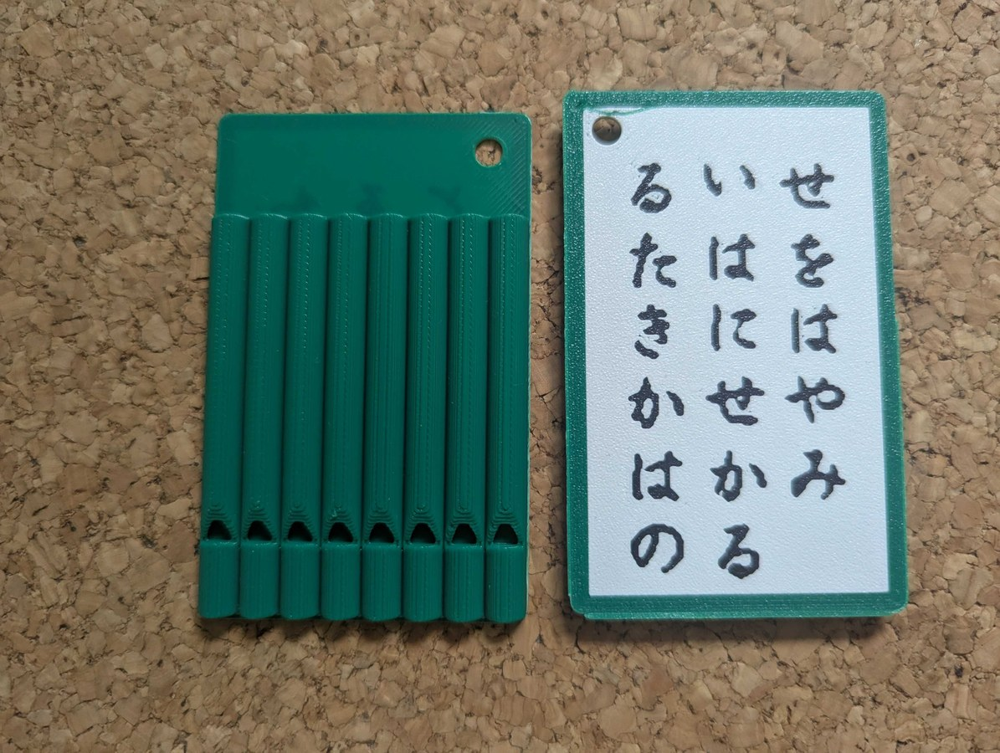
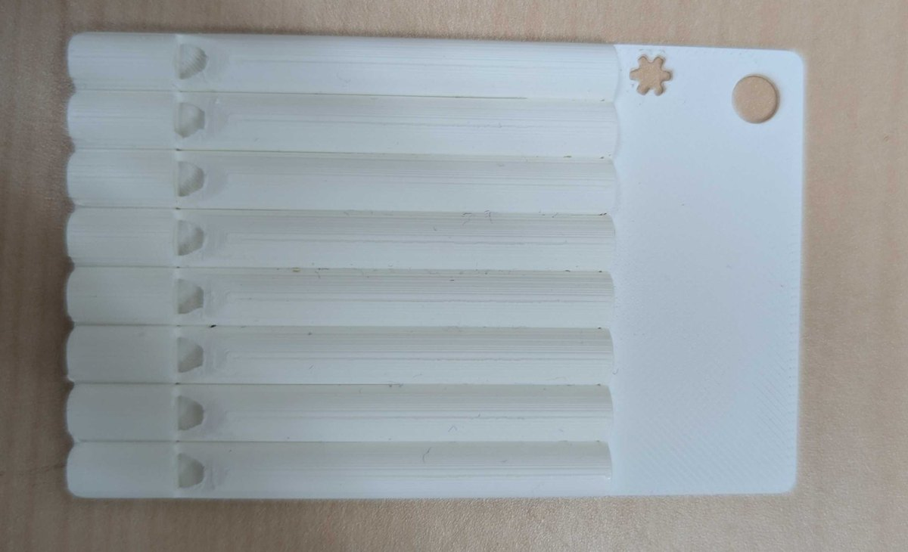
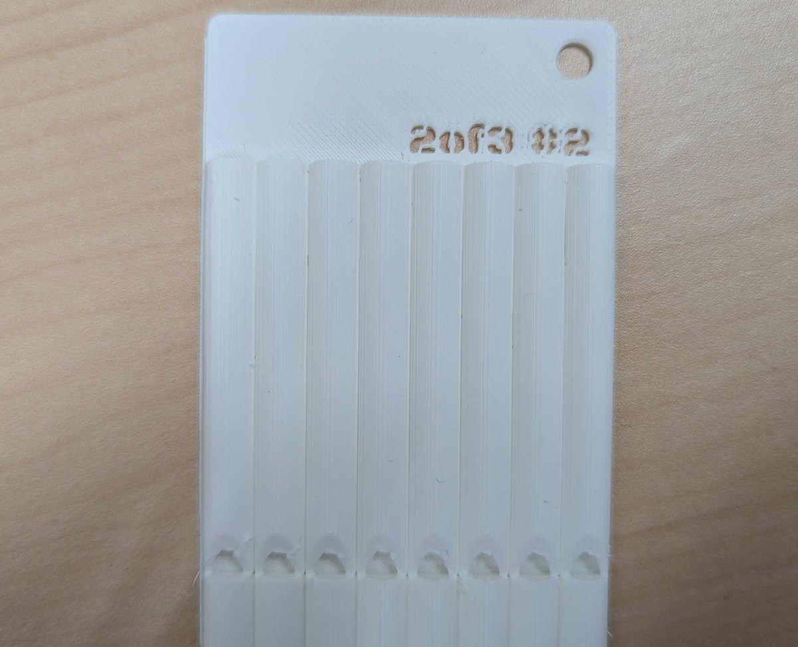
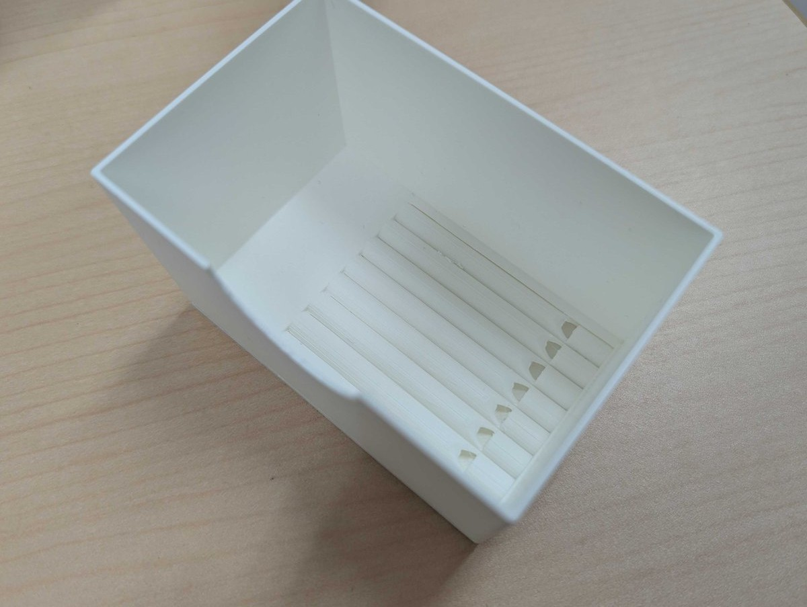
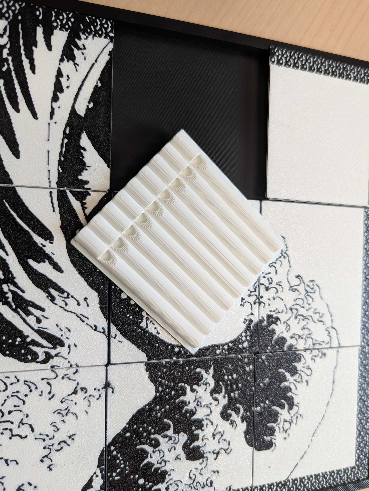
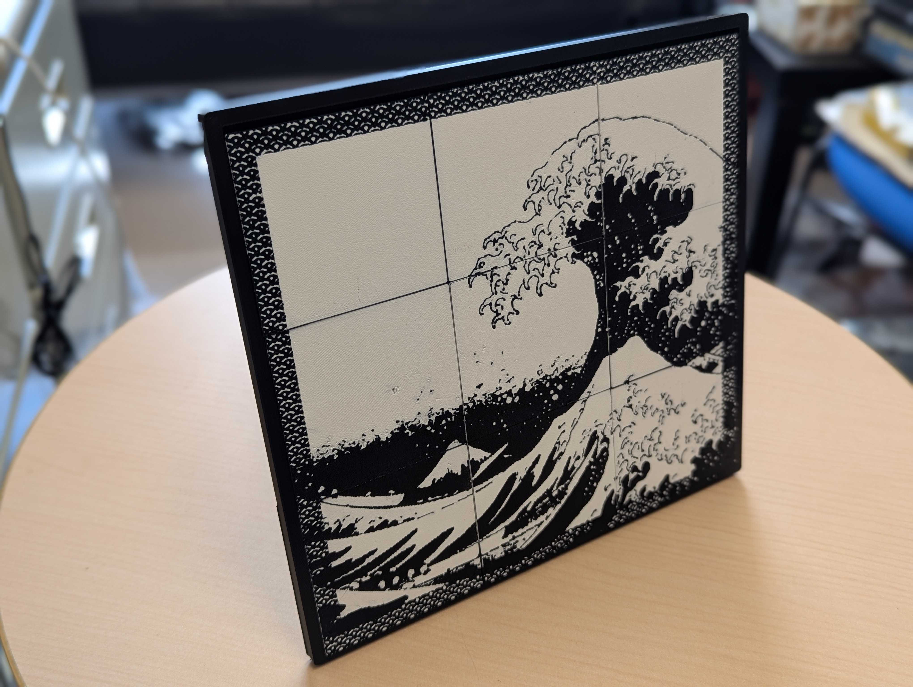
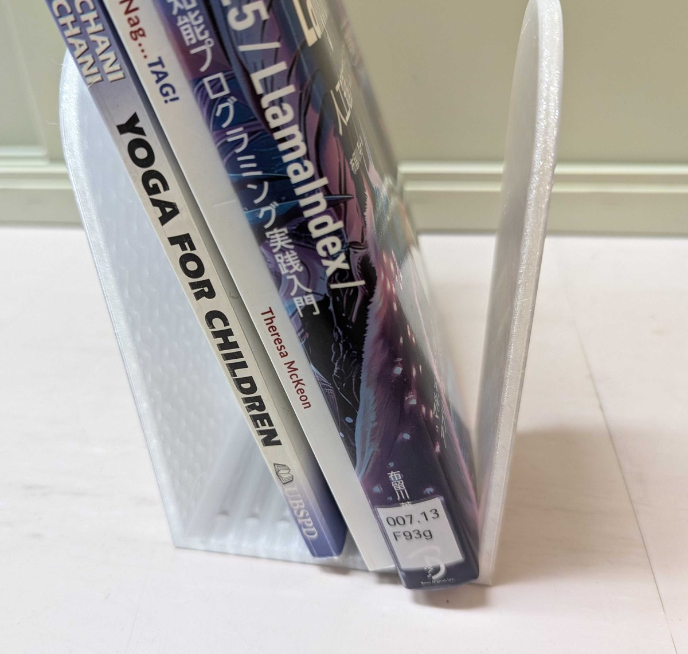

# 作例

実機で復号まで通ったものである。造形データは、どれもデモ用の秘密を記録してある。

| 作例 | 秘密の分け方 | 笛の本数 | 造形データ |
|---|---|---|---|
| かるた札ペアキーホルダー2枚 | 2-of-2 | 8本ずつ | `models/karuta_2of2.3mf` |
| ハートを抜いたペアカード | 2-of-2 | 8本ずつ | `models/paircards_2of2.3mf` |
| カード1枚 | 単体、または2-of-3の断片 | 8本 | `models/card.3mf` |
| 箱 | 2-of-3の断片 | 8本 | `models/box.3mf` |
| 画像タイル9枚 | 2-of-9 | 9本ずつ | 額縁と脚のみ同梱 |
| 照合笛 | なし（読み出しの道具） | 12本 | `models/matching.3mf` |

## かるた札ペアキーホルダー2枚

百人一首の1首を上の句と下の句に分けて刷り、それぞれの裏に笛を8本ずつ載せた。
崇徳院の「瀬をはやみ岩にせかるる滝川のわれても末に逢はむとぞ思ふ」を選んである。

**分かれてもいずれまた出会うという歌の内容が、2-of-2の秘密分散そのものになっている。**
2枚をそろえる理由が物の側に書いてあり、歌の完成と秘密の復元が一致する。

- クレジットカードと同じ寸法を縦長にとり、厚さ4.8mm。絵柄0.4mm＋素地0.4mm＋笛4mm
- 白い地に黒い字を刷り、縁を緑で囲んだ3色刷りである
- 絵柄は0.4mmの格子に量子化されるので、1文字を29画素にとって毛筆の入りと払いを残した
- **2枚の札は先頭の2本が同じ音である。**基準笛と、差分の写像で決まる次の1本が
  両方に共通するためで、**吹く向きを間違えていないかは、1本目が基準笛の高さになるかで分かる**

| 写真 | 何が写っているか |
|---|---|
| `photos/karuta_front.jpg` | 2枚を並べたところ。右が上の句、左が下の句 |
| `photos/karuta_back.jpg` | 上の句の札を裏返したところ。笛8本が並ぶ |

 

## ハートを抜いたペアカード

同じ作りのカードを2枚、余白どうしを向かい合わせに並べ、その境界にハートを抜いた。
1枚では半分のハートにしかならず、**2枚をそろえて初めてハートが現れる。**

秘密は2-of-2で分け、片方に一方の値を、もう片方に秘密からその値を引いた値を割り当てる。
方式としては、片方だけでは一様な乱数にしか見えない。
**ただしこのリポジトリの実装は、再現できるように分け方の値を固定してある。**
実際に配る物を作るときは、組ごとに種を変えること。

合成した秘密を鍵として遷移先のURLを暗号化しておくと、2枚がそろったときにだけそのページが開く。
この秘匿の強度は、載っている情報量（20.8bit）のままである。

| 写真 | 何が写っているか |
|---|---|
| `photos/paircards.jpg` | 2枚をそろえてハートが現れたところ |

## カード1枚

クレジットカード大の板（85.6 × 54 × 4mm）に笛8本を融合したものである。
先頭の1本を基準笛にあて、残り7本にデータとパリティの記号を載せる。**20.8bitを記録する。**

財布に入れて持ち歩ける薄さで、見た目は音楽用のカードと同じである。

| 写真 | 何が写っているか |
|---|---|
| `photos/card.jpg` | カード1枚。右上の印が吹き始めである |
| `photos/card_2of3.jpg` | 2-of-3の断片を担当するカード |

 

## 箱

箱の床に笛を埋め込んだものである。

ペンを立てれば、机の上では文房具に見える。

| 写真 | 何が写っているか |
|---|---|
| `photos/box_inside.jpg` | 箱の内部。床に笛を埋め込んである |
| `photos/box_pens.jpg` | ペンを立てたところ |

 

カードと箱は、形の違う日用品で2-of-3の秘密分散を分担する組の一部である。

## 暗号笛内蔵画像タイル

絵を格子に割って9枚のタイルにし、それぞれの裏に笛を9本ずつ、合わせて81本を載せた。

**並べ直すと絵が戻り、裏返して吹くと秘密が戻る。**

- 秘密の分け方は 2-of-9。**9枚のうちどの2枚がそろっても復元できる**
- タイルは 68.0 × 64.6 × 4.78mm。絵柄0.4mm＋素地0.4mm＋笛4mm
- 額縁（`models/frame_box.stl`・外寸 214.5 × 204.4 × 6.7mm）に収まる
- 脚（`models/frame_stand.stl`）を背面に貼ると、12度傾いて自立する

| 写真 | 何が写っているか |
|---|---|
| `photos/tiles_framed.jpg` | 9枚を額縁に収めたところ |
| `photos/tiles_back.jpg` | **1枚を裏返したところ。笛9本が並ぶ** |
| `photos/tiles_standing.jpg` | 脚を付けて自立させたところ |

 

**絵柄を下向きに刷る板は、刷る段階で左右を返しておくこと。** 見るときに裏返すので、
返さないと鑑賞時に鏡像になる。写真の作例は、これに気づく前に刷ったものなので鏡像である。

## 照合笛

12個のスロットに対応する笛を、1枚の板に1本ずつ並べた、読み出し用の物差しである。
データの笛と聞き比べ、同じ高さで発音する笛を探す。**うなりが消えたところに刻んである
番号が、そのスロットの記号である。** 電子機器を持たない読み出しは、この板で完結する。

- **すべての笛が同じ外形である。** 長さから音高を当てられないので、読み手は刻んだ番号で見分ける。データの笛と造形の条件もそろう
- 番号0〜11は各笛の足の先に、板だけを貫通する抜き文字として刻んである。番号そのものが順序と向きを示す
- 秘密を載せていないので、この造形データは共有できる。データの笛と同じプリンタ・同じ材料で刷ると、個体差が共通になって聞き比べやすい

| 写真 | 何が写っているか |
|---|---|
| `photos/matching.jpg` | 照合笛。12スロットの笛を1枚の板に並べ、番号を刻んである |

## そのほかの作例（写真のみ）

論文と動画に登場する作例のうち、造形データを未収録のものである。

| 作例 | 何であるか |
|---|---|
| `photos/spool.jpg` | フィラメントのスプール。円盤2枚に笛49本で128bitを記録する |
| `photos/bookstand.jpg` | 本立て。底板に笛36本で64bitを記録する |

 

## 権利について

[../NOTICE.md](../NOTICE.md) を読むこと。
